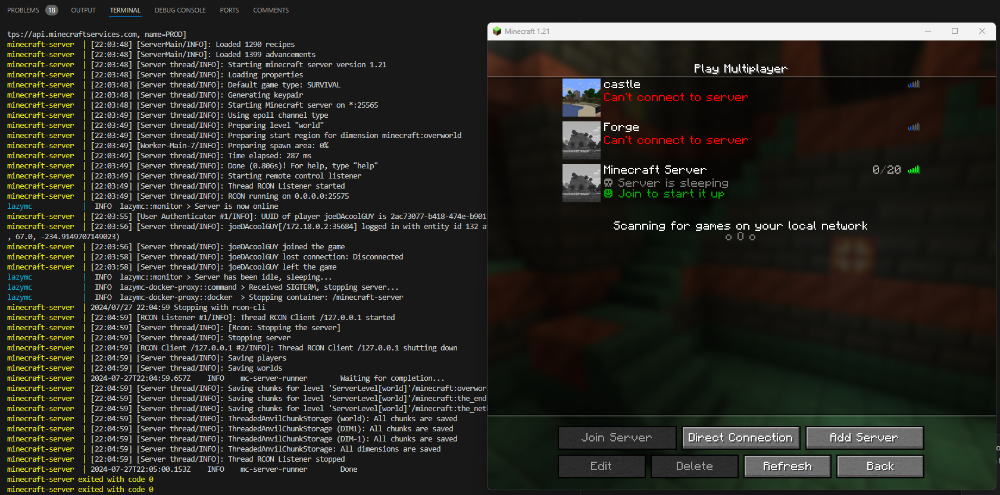

# lazymc-docker-proxy

By using this image, you can combine the straightforward management of Minecraft servers using [itzg/minecraft-server](https://github.com/itzg/docker-minecraft-server) with the efficiency of [lazymc](https://github.com/timvisee/lazymc).

If you have multiple Docker Minecraft servers and you are low on resources or want to save compute power, this project is for you. With `lazymc-docker-proxy`, you can dynamically start a Docker Minecraft server when a player joins and shut it down when the server is idle.

This project is also somewhat inspired by [lazytainer](https://github.com/vmorganp/Lazytainer).



## Usage

### Vanilla minimal Example

Here is a minimal Docker Compose example using [itzg/minecraft-server](https://github.com/itzg/docker-minecraft-server) as the server:

> ⚠️ It is **very important** that you assign **static** IP Address to each container.
This is due to quirk in how lazymc monitors the servers, it does not expect the IP address of a server to change,
this can happen when a container stops and starts again There is an [opened issue](https://github.com/joesturge/lazymc-docker-proxy/issues/63) for this.
As this is an issue with lazymc itself it is unlikely that a fix can be found. Im open to suggestions on this.

```yaml
# Lazymc requires that the minecraft server have a static IP.
#
# To ensure that our servers have a static IP we need to create
# a network for our services to use.
#
# By default, Docker uses 172.17.0.0/16 subnet range.
# So we need to create a new network in a different subnet
# See the readme for more information.
#
# Please ensure that the subnet falls within the private CIDRs:
# https://datatracker.ietf.org/doc/html/rfc1918#section-3
#
# And that it is not in use by anything else.
networks:
  minecraft-network:
    driver: bridge    
    ipam:
      config:
        - subnet: 172.18.0.0/16

services:
  lazymc:
    image: ghcr.io/joesturge/lazymc-docker-proxy:latest
    # the IPs should start at .2 as .1 is reserved for the gateway
    networks:
      minecraft-network:
        ipv4_address: 172.18.0.2
    restart: unless-stopped
    volumes:
      # you should mount the minecraft server dir under /server, using read only.
      - data:/server:ro
      # you need to supply the docker socket, so that the container can run docker command
      - /var/run/docker.sock:/var/run/docker.sock:ro
    ports:
      # lazymc-docker-proxy acts as a proxy, so there is
      # no need to expose the server port on the Minecraft container
      - "25565:25565"

  # Standard Docker Minecraft server, also works with other server types
  mc:
    image: itzg/minecraft-server:java21
    # Assign a static IP to the server container
    networks:
      minecraft-network:
        ipv4_address: 172.18.0.3
    # We need to add a label here so that lazymc-docker-proxy knows which
    # container to manage
    labels:
      # Set lazymc.enabled to true to enable lazymc on this container
      - lazymc.enabled=true
      # Required to find the container to manage it
      - lazymc.group=mc
      # Point to the service name of the Minecraft server
      - lazymc.server.address=mc:25565
    tty: true
    stdin_open: true
    # This container should be managed solely by the lazymc container
    # so set restart to no, or else the container will start again...
    restart: no
    environment:
      EULA: "TRUE"
    volumes:
      - data:/data

volumes:
  data:
```

### Multiple server support

This container can also proxy to and control multiple containers at once. You could use it with `itzg/mc-router` if you choose to:

```yaml
networks:
  minecraft-network:
    driver: bridge    
    ipam:
      config:
        - subnet: 172.18.0.0/16

services:
  router: 
    # You can use mc-router to route external traffic to your
    # servers via lazymc using the Host header.
    #
    # This allows you to run multiple servers on the same external port
    image: itzg/mc-router
    # You need to assign a static IP to the mc-router container
    # the IPs should start at .2 as .1 is reserved for the gateway
    networks:
      minecraft-network:
        ipv4_address: 172.18.0.2
    depends_on:
      - lazymc
    environment:
      # Primary is exposed on port 25565 of lazymc
      # Secondary is exposed on port 25566 of lazmc
      MAPPING: |
        primary.example.com=lazymc:25565
        secondary.example.com=lazymc:25566
    # If using mc-router you only need to expose port 25565
    # on this container alone
    ports:
      - "25565:25565"

  lazymc:
    image: ghcr.io/joesturge/lazymc-docker-proxy:latest
    # Assign a static IP to the lazymc container
    networks:
      minecraft-network:
        ipv4_address: 172.18.0.3
    restart: unless-stopped
    environment:
      RUST_LOG: "trace"
    volumes:
      - /var/run/docker.sock:/var/run/docker.sock:ro
      # primary server volume mount, should match the label
      - data-primary:/server/primary:ro
      # secondary server volume mount, should match the label
      - data-secondary:/server/secondary:ro
    # If you are using mc-router you don't actually need
    # to expose these port, but these ports match the ports
    # specified on the labels on the minecraft containers
    # ports:
    #  - "25565:25565"
    #  - "25566:25566"

  primary:
    image: itzg/minecraft-server:java21
    # Assign a static IP to the primary server container
    networks:
      minecraft-network:
        ipv4_address: 172.18.0.4
    labels:
      - lazymc.enabled=true
      - lazymc.group=primary
      - lazymc.server.address=primary:25565
      # If using with multiple servers you should specify
      # which port you want to this server to be accessible
      # from on the lazymc-docker-proxy container
      - lazymc.port=25565
      # If using with multiple servers you should specify
      # which path you have mounted the server volume on
      - lazymc.server.directory=/server/primary
    tty: true
    stdin_open: true
    restart: no
    environment:
      EULA: "TRUE"
    volumes:
      # mount the primary server volume
      - data-primary:/data

  secondary:
    image: itzg/minecraft-server:java21
    # Assign a static IP to the secondary server container
    networks:
      minecraft-network:
        ipv4_address: 172.18.0.5
    labels:
      - lazymc.enabled=true
      - lazymc.server.address=secondary:25565
      - lazymc.group=secondary
      # If using with multiple servers you should specify
      # which port you want to this server to be accessible
      # from on the lazymc-docker-proxy container
      - lazymc.port=25566
      # If using with multiple servers you should specify
      # which path you have mounted the server volume on
      - lazymc.server.directory=/server/secondary
    tty: true
    stdin_open: true
    restart: no
    environment:
      EULA: "TRUE"
    volumes:
      # mount the secondary server volume
      - data-secondary:/data

volumes:
  # volume for primary server
  data-primary:
  # volume for secondary server
  data-secondary:
```

### Forge 1.19.2

```yaml
networks:
  minecraft-network:
    driver: bridge    
    ipam:
      config:
        - subnet: 172.18.0.0/16

services:
  lazymc:
    image: ghcr.io/joesturge/lazymc-docker-proxy:latest
    networks:
      minecraft-network:
        ipv4_address: 172.18.0.2
    restart: unless-stopped
    volumes:
      - /var/run/docker.sock:/var/run/docker.sock:ro
      - data:/server:ro
    ports:
      - "25565:25565"

  mc:
    image: itzg/minecraft-server:java21
    networks:
      minecraft-network:
        ipv4_address: 172.18.0.3
    labels:
      - lazymc.enabled=true
      - lazymc.group=mc
      - lazymc.server.address=mc:25565
      # The minecraft client version of the forge server
      - lazymc.public.version=1.19.2
      # The minecraft protocol version of the forge server
      - lazymc.public.protocol=760
      # Set to true on a forge server
      - lazymc.server.forge=true
    tty: true
    stdin_open: true
    restart: no
    environment:
      EULA: "TRUE"
      TYPE: FORGE
      # The minecraft client version
      VERSION: "1.19.2"
    volumes:
      - data:/data

volumes:
  data:
```

## Kubernetes Support

`lazymc-docker-proxy` now supports running on Kubernetes! Instead of managing Docker containers, it can manage Kubernetes Deployments and StatefulSets by scaling them up when players connect and down when the server is idle.

### Backend Auto-Detection

The proxy automatically detects whether it's running in Docker or Kubernetes:
- **Kubernetes**: Detected by the presence of `/var/run/secrets/kubernetes.io/serviceaccount/token`
- **Docker**: Detected by the presence of `/var/run/docker.sock`

You can also explicitly set the backend using the `LAZYMC_BACKEND` environment variable:
- `LAZYMC_BACKEND=kubernetes` or `k8s` - Force Kubernetes backend
- `LAZYMC_BACKEND=docker` - Force Docker backend

### Kubernetes Setup

To use `lazymc-docker-proxy` with Kubernetes, you need to:

1. Provide appropriate RBAC permissions for the proxy to manage pods and deployments
2. Label your Minecraft server Deployments/StatefulSets with the same labels you would use for Docker containers
3. (Optional) Set `LAZYMC_BACKEND=kubernetes` to explicitly use Kubernetes mode (auto-detected by default)

Here's a complete example:

```yaml
apiVersion: v1
kind: Namespace
metadata:
  name: minecraft
---
apiVersion: v1
kind: ServiceAccount
metadata:
  name: lazymc-proxy
  namespace: minecraft
---
apiVersion: rbac.authorization.k8s.io/v1
kind: Role
metadata:
  name: lazymc-proxy-role
  namespace: minecraft
rules:
- apiGroups: [""]
  resources: ["pods"]
  verbs: ["get", "list", "watch", "delete"]
- apiGroups: ["apps"]
  resources: ["deployments", "statefulsets"]
  verbs: ["get", "list", "watch", "patch"]
---
apiVersion: rbac.authorization.k8s.io/v1
kind: RoleBinding
metadata:
  name: lazymc-proxy-binding
  namespace: minecraft
subjects:
- kind: ServiceAccount
  name: lazymc-proxy
  namespace: minecraft
roleRef:
  kind: Role
  name: lazymc-proxy-role
  apiGroup: rbac.authorization.k8s.io
---
apiVersion: apps/v1
kind: Deployment
metadata:
  name: minecraft-server
  namespace: minecraft
  labels:
    app: minecraft
    lazymc.enabled: "true"
    lazymc.group: "mc"
spec:
  replicas: 0  # Start with 0 replicas, lazymc will scale it up
  selector:
    matchLabels:
      app: minecraft
  template:
    metadata:
      labels:
        app: minecraft
        lazymc.enabled: "true"
        lazymc.group: "mc"
      annotations:
        lazymc.server.address: "minecraft-server:25565"
        lazymc.time.minimum_online_time: "30"
        lazymc.time.sleep_after: "60"
    spec:
      containers:
      - name: minecraft
        image: itzg/minecraft-server:java21
        env:
        - name: EULA
          value: "TRUE"
        ports:
        - containerPort: 25565
          name: minecraft
        volumeMounts:
        - name: data
          mountPath: /data
      volumes:
      - name: data
        persistentVolumeClaim:
          claimName: minecraft-data
---
apiVersion: v1
kind: Service
metadata:
  name: minecraft-server
  namespace: minecraft
spec:
  selector:
    app: minecraft
  ports:
  - protocol: TCP
    port: 25565
    targetPort: 25565
---
apiVersion: apps/v1
kind: Deployment
metadata:
  name: lazymc-proxy
  namespace: minecraft
spec:
  replicas: 1
  selector:
    matchLabels:
      app: lazymc-proxy
  template:
    metadata:
      labels:
        app: lazymc-proxy
    spec:
      serviceAccountName: lazymc-proxy
      containers:
      - name: lazymc-proxy
        image: ghcr.io/joesturge/lazymc-docker-proxy:latest
        # LAZYMC_BACKEND is auto-detected, but can be explicitly set:
        # env:
        # - name: LAZYMC_BACKEND
        #   value: "kubernetes"
        ports:
        - containerPort: 25565
          name: minecraft-proxy
---
apiVersion: v1
kind: Service
metadata:
  name: lazymc-proxy
  namespace: minecraft
spec:
  type: LoadBalancer
  selector:
    app: lazymc-proxy
  ports:
  - protocol: TCP
    port: 25565
    targetPort: 25565
```

### Key Differences from Docker

When running on Kubernetes:

- **Scaling instead of start/stop**: The proxy scales Deployments/StatefulSets to 0 when idle and to 1 (or their configured replica count) when players connect
- **Labels and Annotations**: Use labels for simple identifiers (like `lazymc.enabled` and `lazymc.group`) and annotations for configuration values that may contain special characters (like addresses with ports)
- **Pod IPs**: Kubernetes automatically assigns pod IPs, which are used by lazymc to connect to the server
- **RBAC Required**: The proxy needs permissions to list pods and patch deployments/statefulsets
- **Service Account**: The proxy pod must use a ServiceAccount with the appropriate Role

### Kubernetes Labels and Annotations

Configuration in Kubernetes uses both labels and annotations on pod template metadata:

**Labels** (for identification and selection):
- **lazymc.enabled=true** - Enable management by lazymc-docker-proxy (required for selection)
- **lazymc.group** - Identifier for the server group (required)

**Annotations** (for configuration values):
- **lazymc.server.address** - Service name and port (e.g., `minecraft-server:25565`)
- All other lazymc configuration options (times, messages, etc.)

Example:
```yaml
template:
  metadata:
    labels:
      app: minecraft
      lazymc.enabled: "true"
      lazymc.group: "mc"
    annotations:
      lazymc.server.address: "minecraft-server:25565"
      lazymc.time.sleep_after: "60"
```

> **Note**: Kubernetes labels have character restrictions (alphanumeric, `-`, `_`, `.` only), so configuration values that may contain colons or other special characters must use annotations instead.

### Configuration using labels

The suggested way to manage the lazymc settings on your minecraft containers is to use container labels.

This allows you to manage multiple minecraft servers at once.

Here is the list of the supported container labels which can be added to the minecraft server container
which will be picked up by `lazymc-docker-proxy` (\* is required):

- **\*lazymc.enabled=true** - Enable this to inform `lazymc-docker-proxy` that this container should be managed.
- **\*lazymc.server.address** - The address of the Docker Minecraft server to manage, should use the internal Docker network address of the server container, such as `mc:25565` or the assigned static IP such as `172.18.0.3:25565`.
- **\*lazymc.group** - This is used by `lazymc-docker-proxy` to locate the container to start and stop
- **lazymc.port** - The port on the `lazymc-docker-proxy` container this server will be accessible from. Defaults to `25565`.
- **lazymc.join.methods** - Methods to use to occupy a client on join while the server is starting (separated by commas).
- **lazymc.join.kick.starting** - Message shown when client is kicked while server is starting.
- **lazymc.join.kick.stopping** - Message shown when client is kicked while server is stopping.
- **lazymc.join.hold.timeout** - Hold client for number of seconds on connect while server starts. Keep below Minecraft timeout of 30 seconds.
- **lazymc.join.forward.address** - IP and port to forward to.
- **lazymc.join.forward.send_proxy_v2** - Add HAProxy v2 header to forwarded connections.
- **lazymc.join.lobby.timeout** - Maximum time in seconds in the lobby while the server starts.
- **lazymc.join.lobby.message** - Message banner in lobby shown to client.
- **lazymc.join.lobby.ready_sound** - Sound effect to play when server is ready.
- **lazymc.lockout.enabled** - Enable to prevent everybody from connecting through lazymc. Instantly kicks player.
- **lazymc.lockout.message** - Kick players with following message.
- **lazymc.motd.sleeping** - MOTD, shown in the server browser when sleeping.
- **lazymc.motd.starting** - MOTD, shown in the server browser when starting.
- **lazymc.motd.stopping** - MOTD, shown in the server browser when stopping.
- **lazymc.motd.from_server** - Use MOTD from Minecraft server once known.
- **lazymc.public.protocol** - The minecraft client version to use. See [this page](https://minecraft.wiki/w/Protocol_version) for information.
- **lazymc.public.version** - The minecraft protocol version to use. See [this page](https://minecraft.wiki/w/Protocol_version) for information.
- **lazymc.server.directory** - The location of the volume mount within `lazymc-docker-proxy` which contains data for this minecraft server. Defaults to `/server`.
- **lazymc.server.probe_on_start** - Probe required server details when starting lazymc, wakes server on start.
- **lazymc.server.forge** - Set to true if this server runs Forge.
- **lazymc.server.start_timeout** - Server start timeout in seconds. Force kill server process if it takes too long.
- **lazymc.server.stop_timeout** - Server stop timeout in seconds. Force kill server process if it takes too long.
- **lazymc.server.wake_whitelist** - To wake the server, the user must be in the server whitelist if enabled on the server.
- **lazymc.server.block_banned_ips** - Block banned IPs as listed in banned-ips.json in the server directory.
- **lazymc.server.drop_banned_ips** - Drop connections from banned IPs.
- **lazymc.server.send_proxy_v2** - Add HAProxy v2 header to proxied connections.
- **lazymc.time.sleep_after** - Sleep after a number of seconds.
- **lazymc.time.minimum_online_time** - Minimum time in seconds to stay online when the server is started.

> Note: `wake_on_crash` and `wake_on_start` are not configurable due to how lazymc starts the server. When running in Docker Compose, all containers are started by default, so `wake_on_start` must also be true when using this image. `wake_on_crash` is also true as it is recommended to launch the Minecraft server with `restart: no`.  
> Note: `rcon` configurations are not supported as this app relies on the SIGTERM signal to stop the server.

If you want more details or have issues, you can also refer to the lazymc [documentation](https://github.com/timvisee/lazymc/tree/master).

Also, refer to the lazymc [config example](https://github.com/timvisee/lazymc/blob/master/res/lazymc.toml). You may notice that the environment variables are named in the same way. This is intentional...

### Environment Variables

You can enable debug logging using the `RUST_LOG` env var.

- **RUST_LOG** - Set this to `trace` or `debug` to troubleshoot issues.

#### Deprecated

> ⚠️ Using environment variables to configure the server is deprecated and will be removed in the next release, please use container labels on the minecraft server instead. These are still available for the time being.

Here is a full list of the environment variables supported by this image (\* is required):

- **\*SERVER_ADDRESS** - The address of the Docker Minecraft server to manage, should use the internal Docker network address of the server container, such as `mc:25565` or the assigned static IP such as `172.18.0.3:25565`.
- **\*LAZYMC_GROUP** - The value of the `lazymc.group` label assigned to the Docker Minecraft server. This is used by the image to start or stop the server when lazymc triggers it.
- **LAZYMC_PORT** - The port on the `lazymc-docker-proxy` container this server will be accessible from. Defaults to `25565`.
- **LAZYMC_JOIN_METHODS** - Methods to use to occupy a client on join while the server is starting (separated by commas).
- **LAZYMC_JOIN_KICK_STARTING** - Message shown when client is kicked while server is starting.
- **LAZYMC_JOIN_KICK_STOPPING** - Message shown when client is kicked while server is stopping.
- **LAZYMC_JOIN_HOLD_TIMEOUT** - Hold client for number of seconds on connect while server starts. Keep below Minecraft timeout of 30 seconds.
- **LAZYMC_JOIN_FORWARD_ADDRESS** - IP and port to forward to.
- **LAZYMC_JOIN_FORWARD_SEND_PROXY_V2** - Add HAProxy v2 header to forwarded connections.
- **LAZYMC_JOIN_LOBBY_TIMEOUT** - Maximum time in seconds in the lobby while the server starts.
- **LAZYMC_JOIN_LOBBY_MESSAGE** - Message banner in lobby shown to client.
- **LAZYMC_JOIN_LOBBY_READY_SOUND** - Sound effect to play when server is ready.
- **LAZYMC_LOCKOUT_ENABLED** - Enable to prevent everybody from connecting through lazymc. Instantly kicks player.
- **LAZYMC_LOCKOUT_MESSAGE** - Kick players with following message.
- **MOTD_SLEEPING** - MOTD, shown in the server browser when sleeping.
- **MOTD_STARTING** - MOTD, shown in the server browser when starting.
- **MOTD_STOPPING** - MOTD, shown in the server browser when stopping.
- **MOTD_FROM_SERVER** - Use MOTD from Minecraft server once known.
- **PUBLIC_VERSION** - The minecraft client version to use. See [this page](https://minecraft.fandom.com/wiki/Protocol_version) for information.
- **PUBLIC_PROTOCOL** - The minecraft protocol version to use. See [this page](https://minecraft.fandom.com/wiki/Protocol_version) for information.
- **SERVER_WAKE_WHITELIST** - To wake the server, the user must be in the server whitelist if enabled on the server.
- **SERVER_BLOCK_BANNED_IPS** - Block banned IPs as listed in banned-ips.json in the server directory.
- **SERVER_DIRECTORY** - The location of the volume mount within `lazymc-docker-proxy` which contains data for this minecraft server. Defaults to `/server`.
- **SERVER_DROP_BANNED_IPS** - Drop connections from banned IPs.
- **SERVER_PROBE_ON_START** - Probe required server details when starting lazymc, wakes server on start.
- **SERVER_FORGE** - Set to true if this server runs Forge.
- **SERVER_START_TIMEOUT** - Server start timeout in seconds. Force kill server process if it takes too long.
- **SERVER_STOP_TIMEOUT** - Server stop timeout in seconds. Force kill server process if it takes too long.
- **SERVER_SEND_PROXY_V2** - Add HAProxy v2 header to proxied connections.
- **TIME_SLEEP_AFTER** - Sleep after a number of seconds.
- **TIME_MINIMUM_ONLINE_TIME** - Minimum time in seconds to stay online when the server is started.
- **RUST_LOG** - Set this to `trace` or `debug` to troubleshoot issues.

## Development

Thanks for wanting to contribute! Please read the [contributing guidelines](CONTRIBUTING.md) first off.

### Compile locally

To develop changes fork this repo and ensure you have the following installed:

- [rust](https://www.rust-lang.org/tools/install)
- [docker + docker compose](https://docs.docker.com/get-docker/)
- [bats testing](https://bats-core.readthedocs.io/en/stable/installation.html)

Then run the following

```bash
cargo build --release
```

to build the executable under `target/release` directory.

### Docker

To build the dockerfile locally you can run (from the project root)

```bash
docker build .
```

It is good to also check this before committing to make sure you did not break the build

### Testing

There are bats integration test for this application. Which each perform the following:

1. Builds the docker compose file
2. Starts the docker compose environment
3. Waits for the minecraft container(s) to start
4. Waits for lazymc to stop the minecraft container(s)

These checks are performed in using github actions on every commit

### Changelog

This project uses [keepachangelog](https://keepachangelog.com/en/1.1.0/) to maintain it's changelog.
If you are proposing a change please update the [changelog](CHANGELOG.md) by adding your changes under the `[Unreleased]` header

## Thanks

Thanks for taking the time to check this project out, I hope it helps you manage your minecraft servers for years to come!
